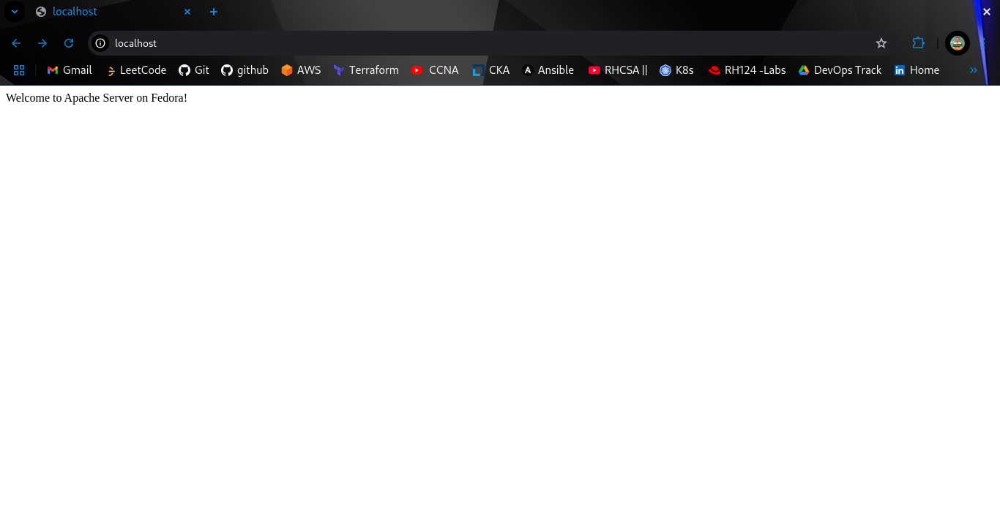
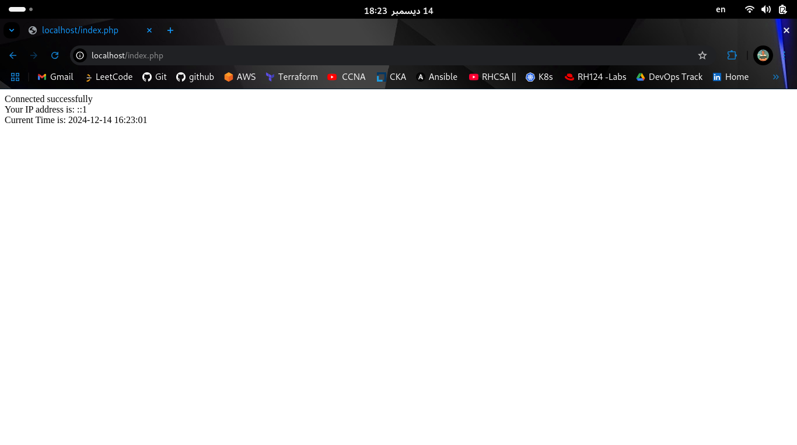
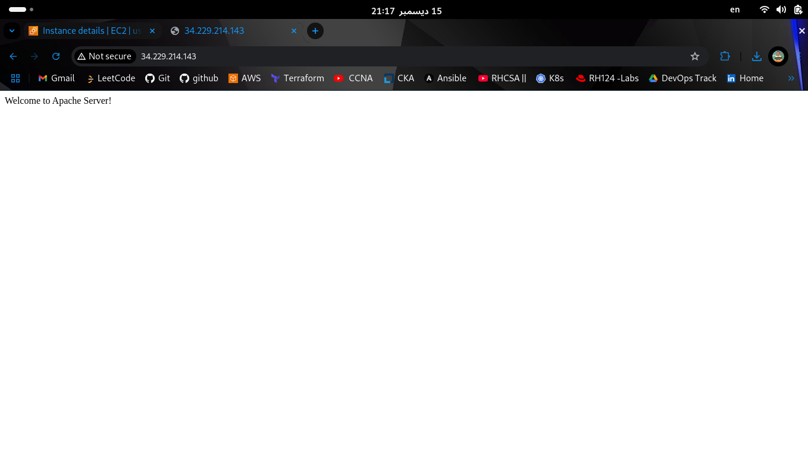
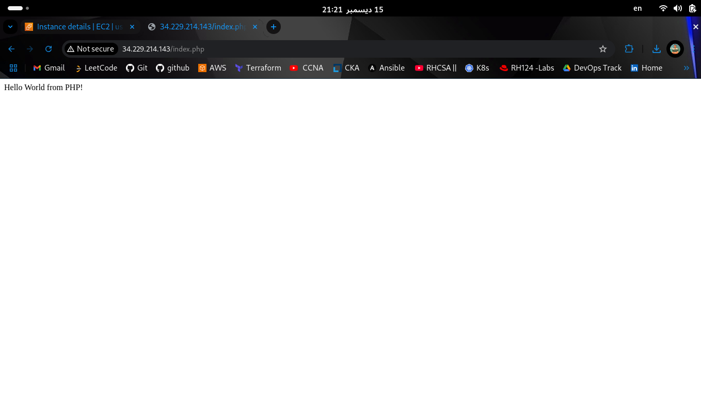
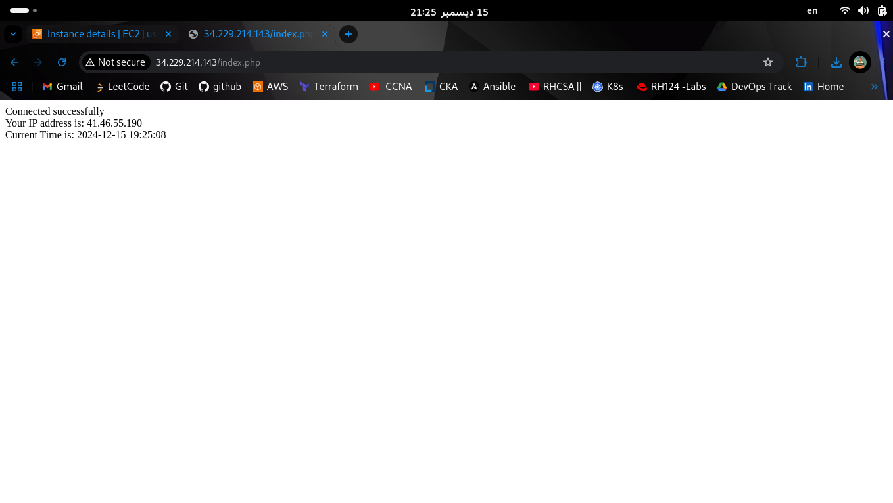

# Setting Up For Basic LAMP Stack 

Test the Public  via a public URL on http://3.89.204.96/index.php .


- **Web Server:** Apache
- **Database Server:** MariaDB
- **Programming Language:** PHP
- **Operating System:** Ubuntu
- 
Each section below includes detailed steps for installation and configuration.


---

## Step-by-Step explanation 

### 1. **Update the System**
First, make sure your system is up-to-date:

```bash
# Update the package list and upgrade the installed packages
$ sudo apt update
$ sudo apt upgrade -y
```
### 2. **Install Apache, PHP, and MariaDB**
Install Apache Web Server, MariaDB Database Server

```bash
$ sudo apt install apache2 mariadb-server php php-mysqlnd -y

```

### 3. **Start the Services**

```bash
# Start Apache and MariaDB
$ sudo systemctl start httpd
$ sudo systemctl start mariadb

```

### 4. **Check the services are running**

```bash
$ sudo systemctl status httpd
$ sudo systemctl status mariadb

```


### 5. **Test Apache Setup**
Apache by default serves files from /var/www/html/.  to test the setup 




### 6. **Test PHP**
To verify that PHP is working with Apache


### `index.php`

This file serves as the main entry point for the simple PHP-based webpage hosted as part of the LAMP stack setup task. that can display dynamic content from the server.

- The file outputs a simple welcome message to verify PHP functionality with Apache.
- It is designed to test the connection between PHP and the Apache server





---

#LAMP Stack on AWS Cloud

Test the Public  via a public URL on http://3.89.204.96/index.php  .

### 1. **Install Apache, PHP, and MariaDB**
Install Apache Web Server, MariaDB Database Server

```bash
$ sudo apt install apache2 mariadb-server php php-mysqlnd -y

```

### 2. **Start the Services**

```bash
$ sudo systemctl start httpd
$ sudo systemctl start mysql

```

### 3. **Check the services are running**

```bash
$ sudo systemctl status httpd
$ sudo systemctl status mariadb

```


### 4. **Test Apache Setup**
Apache by default serves files from /var/www/html/.  to test the setup 




### 5. **Test PHP**
To verify that PHP is working with Apache




### `index.php` with differce date

- It is designed to test the connection between PHP and the Apache server with differce date




### `index.php`

- The file outputs a simple welcome message to verify PHP functionality with Apache  with differce date


### `index.php`

- The file outputs a simple welcome message to verify PHP functionality with Apache  with differce date


